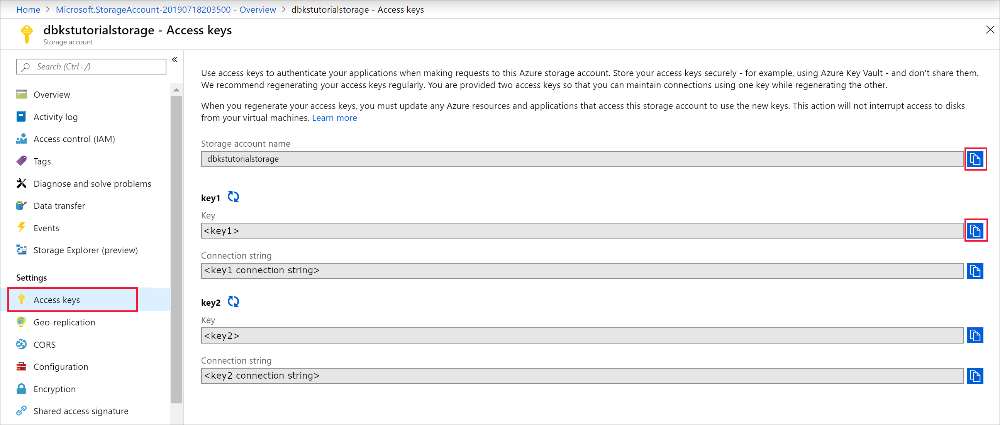
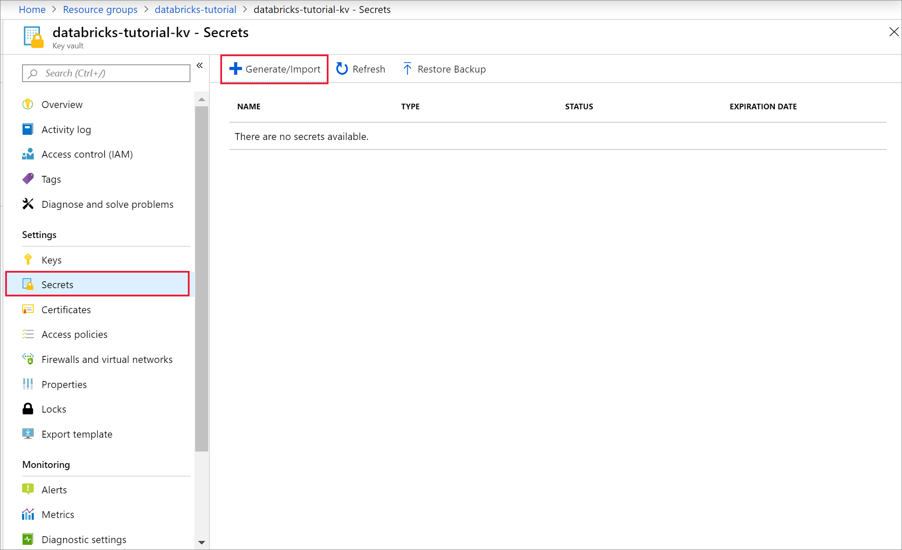
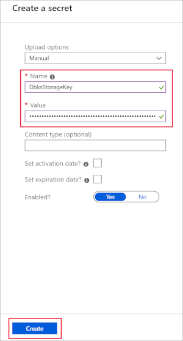
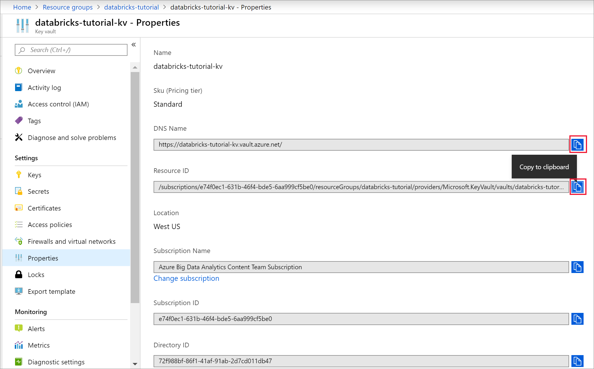
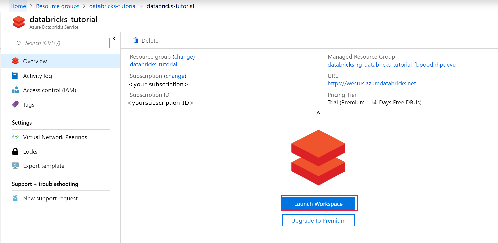
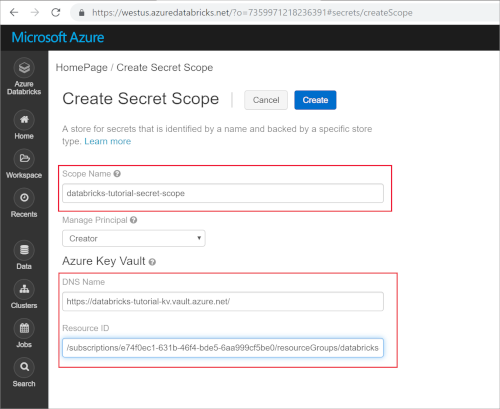
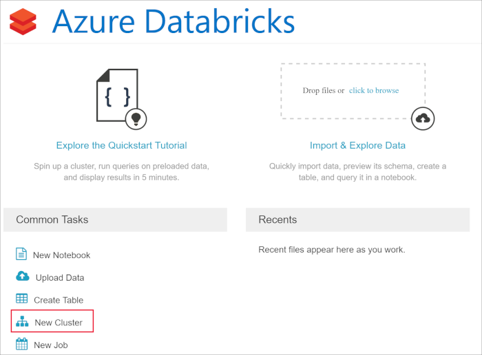
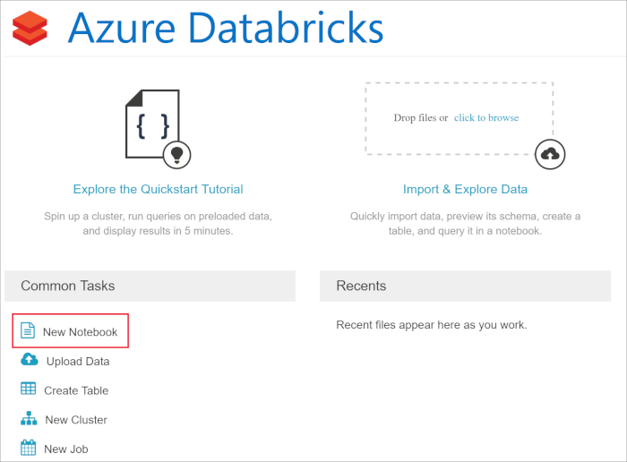
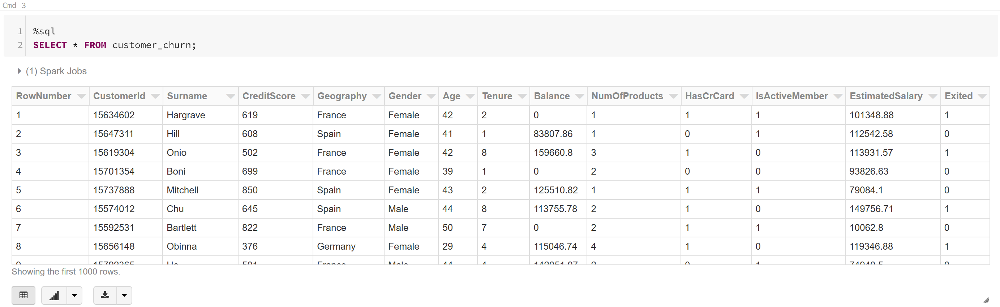

# Azure Customer Churn Hackathon


## 2 Data Load with Azure Databricks

### Contents

- [Azure Customer Churn Hackathon](../README.md)
  - [2 Data Load with Azure Databricks](#2-data-load-with-azure-databricks)
    - [2.1 Set-up Secret Store with Azure Key Vault](#21-set-up-secret-store-with-azure-key-vault)
      - [2.1.1 Create an Azure Key Vault - Use Azure CLI](#211-create-an-azure-key-vault---use-azure-cli)
      - [2.1.2 Create an Azure Key Vault - Use Azure Portal](#212-create-an-azure-key-vault---use-azure-portal)
    - [2.2 Create a Secret and Secret scope for Azure Storage Account](#22-create-a-secret-and-secret-scope-for-azure-storage-account)
      - [2.2.1 Get Storage Account Key](#221-get-storage-account-key)
      - [2.2.2 Create Azure Key Vault Secret](#222-create-azure-key-vault-secret)
      - [2.2.3 Create Azure Databricks Secret Scope](#223-create-azure-databricks-secret-scope)
    - [2.3 Mounting Azure Storage Account with Azure Databricks](#23-mounting-azure-storage-account-with-azure-databricks)
      - [2.3.1 Create Databricks Cluster](#231-create-databricks-cluster)
      - [2.3.2 Create Databricks Notebook](#232-create-databricks-notebook)
    - [2.4 Loading Customer Churn Data](#24-loading-customer-churn-data)
      - [2.4.1 Mount Storage Account](#241-mount-storage-account)
        - [2.4.1.1 Example Mount](#2411-example-mount)
        - [2.4.1.2 Customer Churn Mount](#2412-customer-churn-mount)
      - [2.4.1 Load Customer Churn Data](#241-load-customer-churn-data)
### 2.1 Set-up Secret Store with Azure Key Vault

Azure Key Vault can be used to Securely store and tightly control access to tokens, passwords, certificates, API keys, and other secrets

#### 2.1.1 Create an Azure Key Vault - Use Azure CLI

```bash
keyVaultName=churnhackaVault-$RANDOM
az keyvault create --name $keyVaultName --resource-group $resourceGroupName --location $location
```

#### 2.1.2 Create an Azure Key Vault - Use Azure Portal

[Create an Azure Key Vault](https://docs.microsoft.com/en-us/azure/key-vault/quick-create-portal#create-a-vault)

### 2.2 Create a Secret and Secret scope for Azure Storage Account

#### 2.2.1 Get Storage Account Key

Copy Storage account name and key 1 to a text editor for later use in this tutorial.


#### 2.2.2 Create Azure Key Vault Secret

Navigate to your newly created key vault in the Azure portal and select Secrets. Then, select + Generate/Import.



On the Create a secret page, provide the following information, and keep the default values for the remaining fields:

|Property|Value|
|---------------|--------------------------------------------|
|Upload options|Manual|
|Name| Friendly name for your storage account key.|
|Value|key1 from your storage account.|



Save the key name in a text editor for use later in this tutorial, and select Create. Then, navigate to the Properties menu. Copy the DNS Name and Resource ID to a text editor for use later in the tutorial.



#### 2.2.3 Create Azure Databricks Secret Scope

Navigate to your newly created Azure Databricks resource in the Azure portal and select Launch Workspace.



Once your Azure Databricks workspace is open in a separate window, append #secrets/createScope to the URL. The URL should have the following format:
__https://<\location>.azuredatabricks.net/?o=<\orgID>#secrets/createScope.__

Enter a scope name, and enter the Azure Key Vault DNS name and Resource ID you saved earlier. Save the scope name in a text editor for use later in this tutorial. Then, select Create.



### 2.3 Mounting Azure Storage Account with Azure Databricks

#### 2.3.1 Create Databricks Cluster

From the home page of your Azure Databricks workspace, select New Cluster under Common Tasks.



Enter a cluster name and select Create cluster. The cluster creation takes a few minutes to complete.

#### 2.3.2 Create Databricks Notebook

Once the cluster is created, navigate to the home page of your Azure Databricks workspace, select New Notebook under Common Tasks. This will be the Notebook for the initial __Data Load__.



Enter a notebook name (_Data Load_ or _01-Data Load_ or something similar), and set the language to Python. Set the cluster to the name of the cluster you created in the previous step.

### 2.4 Loading Customer Churn Data

#### 2.4.1 Mount Storage Account

Mount the Azure Storage Account where the customer churn CSV is stored; pass the recently created __secret scope__ and __secret__.

##### 2.4.1.1 Example Mount

Example mounting Azure Storage Account

```python
dbutils.fs.mount(
source = "wasbs://<your-container-name>@<your-storage-account-name>.blob.core.windows.net",
mount_point = "/mnt/<mount-name>",
extra_configs = {"<conf-key>":dbutils.secrets.get(scope = "<scope-name>", key = "<key-name>")})
```

* __mount-name__ is a DBFS path representing where the Blob Storage container or a folder inside the container (specified in source) will be mounted.
* __conf-key__ can be either fs.azure.account.key.<\your-storage-account-name>.blob.core.windows.net or fs.azure.sas.<\your-container-name>.<\your-storage-account-name>.blob.core.windows.net
* __scope-name__ is the name of the secret scope you created in the previous section.
* __key-name__ is the name of they secret you created for the storage account key in your key vault.

##### 2.4.1.2 Customer Churn Mount

```python
if not(True in [x.mountPoint == '/mnt/churndata' for x in dbutils.fs.mounts()]):
    dbutils.fs.mount(
    source = "wasbs://data@<your-storage-account-name>blob.core.windows.net",
    mount_point = "/mnt/churndata",
    extra_configs = {"fs.azure.account.key.<your-storage-account-name>.blob.core.windows.net":dbutils.secrets.get(scope = "churnhackscope", key = "churnhack")})
```

#### 2.4.1 Load Customer Churn Data

Read the csv data into a pyspark Dataframe and save as a table for use in additional NoteBooks.

```python
churn_df = spark.read.csv("/mnt/churndata/Churn_Modelling.csv",header=True,inferSchema=True)
churn_df.write.format('delta').mode('overwrite').partitionBy('Geography').option('path', "/mnt/churndata/raw").saveAsTable('customer_churn')
```

View Customer Data


