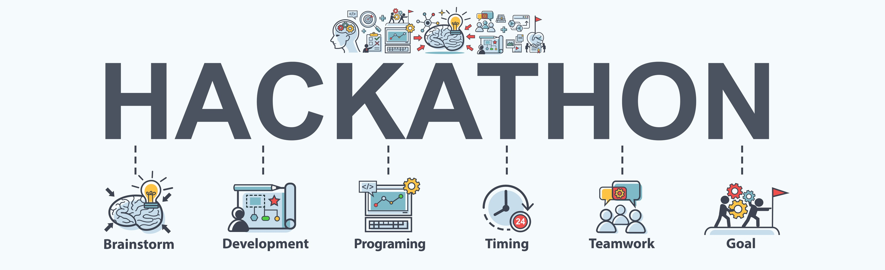

# Azure Customer Churn Hackathon

## 2 Data Preparation with Azure Databricks

### 2.1 Set-up Secret Store with Azure Key Vaule

Azure Key Vault can be used to Securely store and tightly control access to tokens, passwords, certificates, API keys, and other secrets

#### 2.1.1 Create an Azure Key Vault - Use Azure CLI

#### 2.1.2 Create an Azure Key Vault - Use Azure Portal
[Create an Azure Key Vault](https://docs.microsoft.com/en-us/azure/key-vault/quick-create-portal#create-a-vault)

#### 2.1.2 Create a Secret and Secret scope for Azure Storage Account

### 2.2 Loading Data from Azure Storage Account