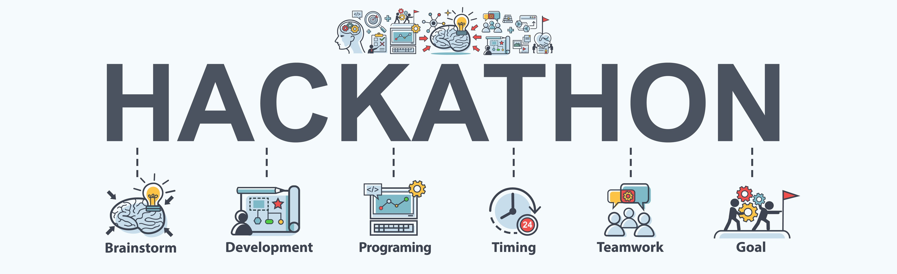
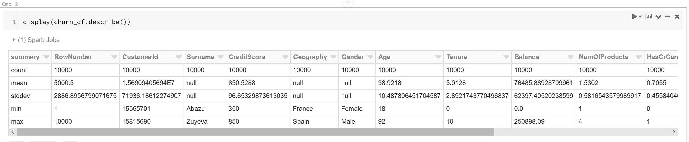
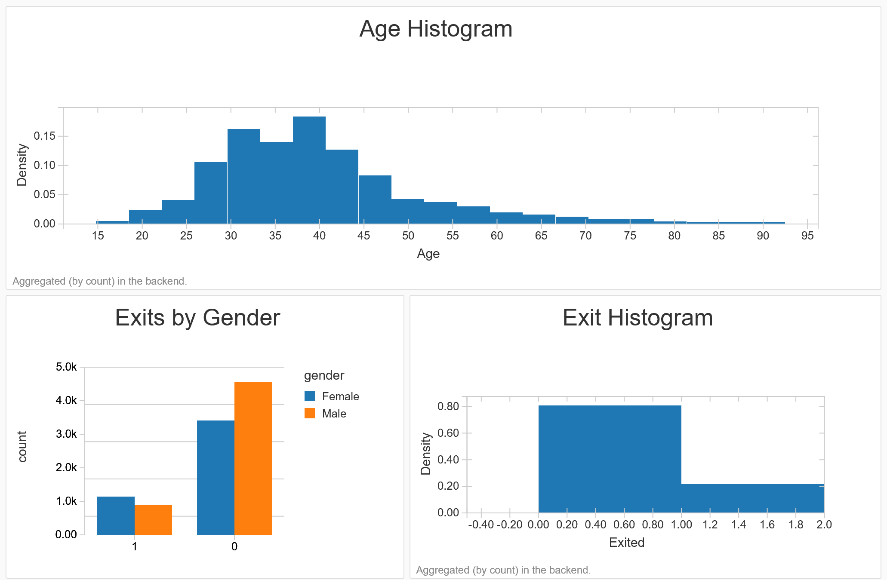
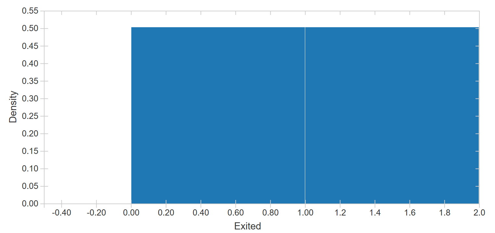
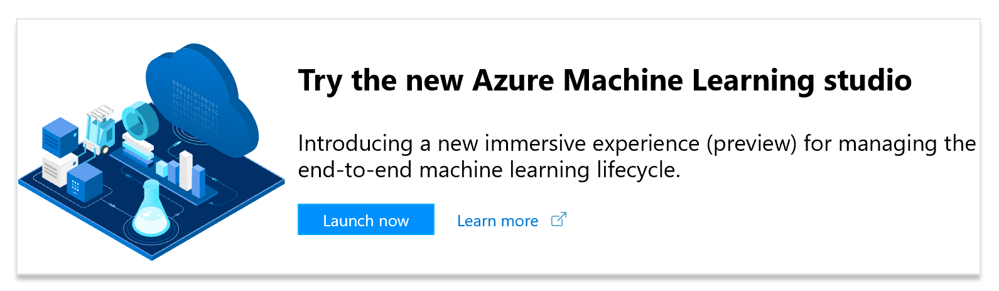
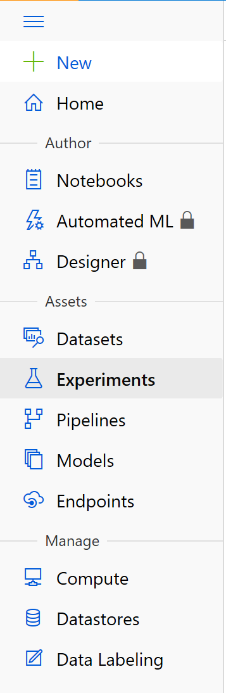
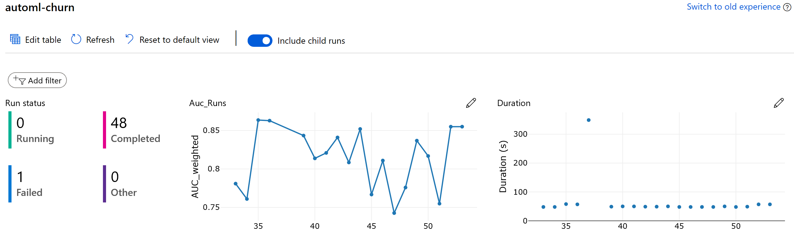
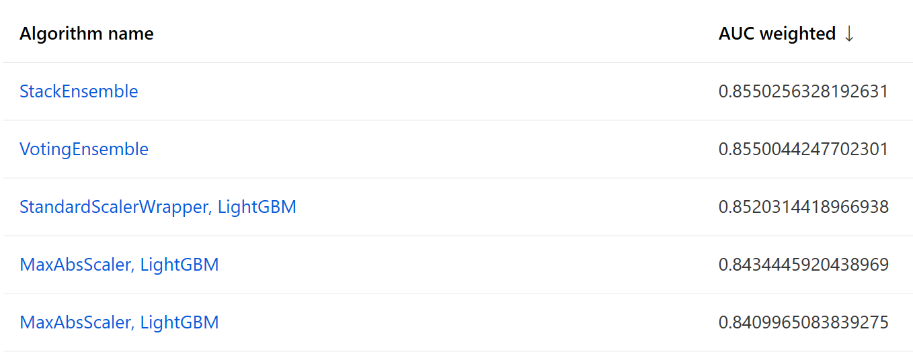

# Azure Customer Churn Hackathon



## 3 Azure Automated ML and Azure Databricks

### Contents

- __3 Azure Automated ML and Azure Databricks__
  * [3.1 Install Python SDK on Databricks](#31-install-python-sdk-on-databricks)
  * [3.2 Prepare the Customer Churn Data](#32-prepare-the-customer-churn-data)
    + [3.2.1 Load Customer Churn Data into Dataframe](#321-load-customer-churn-data-into-dataframe)
    + [3.2.2 Data Prep](#322-data-prep)
      - [3.2.2.1 Undersampling Example](#3221-undersampling-example)
  * [3.3 Training with Azure Automated ML](#33-training-with-azure-automated-ml)
    + [3.3.1 Connect to your workspace](#331-connect-to-your-workspace)
    + [3.3.2 Load Prepped ML Dataset](#332-load-prepped-ml-dataset)
    + [3.3.3 AutoML Configuration](#333-automl-configuration)
    + [3.3.4 Running and AutoML Experiment](#334-running-and-automl-experiment)

### 3.1 Install Python SDK on Databricks

Use these [instructions](https://docs.microsoft.com/en-us/azure/machine-learning/how-to-configure-environment#azure-databricks) to set-up Azure Databricks for Automated Machine Learning.  

We will be installing the Pypi: _azureml-sdk[automl]_

### 3.2 Prepare the Customer Churn Data

Create a new Azure Databricks Notebook for training the Automated ML model

#### 3.2.1 Load Customer Churn Data into Dataframe

```python
churn_df = spark.read.table('customer_churn')
```

{: .image-left } How Does the data look?

Quick Describe



Visualize the data with Azure Databricks



#### 3.2.2 Data Prep

[Example](https://www.kaggle.com/rafjaa/resampling-strategies-for-imbalanced-datasets) on resampling imbalanced data

##### 3.2.2.1 Undersampling Example

```python

drop_columns = ['RowNumber','CustomerId','Surname']
customer_columns = churn_df.columns
column = [x for x in customer_columns if x not in drop_columns]

final_df = churn_df[column]
final_df_pd = final_df.toPandas()

import pandas as pd
# Exited count
count_exited_0, count_exited_1 = final_df_pd.Exited.value_counts()

# Divide by Exited Customers
df_exited_0 = final_df_pd[final_df_pd['Exited'] == 0]
df_exited_1 = final_df_pd[final_df_pd['Exited'] == 1]

df_exited_0_under = df_exited_0.sample(count_exited_1)
df_test_under = pd.concat([df_exited_0_under, df_exited_1], axis=0)

churn_df = spark.createDataFrame(df_test_under)

```



```python
#Save 'Silver' Dataset for Auto ML
churn_df.write.format('delta').mode('overwrite').partitionBy('Geography').option('path', "/mnt/churndata/silver").saveAsTable('customer_churn_silver')
```

### 3.3 Training with Azure Automated ML

#### 3.3.1 Connect to your workspace

```python
from azureml.core.workspace import Workspace
from azureml.train.automl import AutoMLConfig
from azureml.core.experiment import Experiment
import logging


subscription_id = "YOUR SUBSCRIPTION"
resource_group = "YOUR RESOURCE GROUP"
workspace_name =  "AZURE ML WORKSPACE NAME"#your workspace name
workspace_region = "centralus" #your region


ws = Workspace(workspace_name = workspace_name,
               subscription_id = subscription_id,
               resource_group = resource_group)

```

#### 3.3.2 Load Preped ML Dataset

```python
import azureml.dataprep as dprep
import uuid

churn_df = spark.read.table('customer_churn_silver')

x_prep = dprep.read_pandas_dataframe(churn_df.toPandas().drop('Exited',axis=1),temp_folder='/dbfs/tmp'+str(uuid.uuid4()))
y_prep  = dprep.read_pandas_dataframe(churn_df.toPandas()[['Exited']],temp_folder='/dbfs/tmp'+str(uuid.uuid4()))
```

#### 3.3.3 AutoML Configuration

We will crate the AutoMLCofig to specify the setting for our ML experimentation run. Please view the latest parameter details for [AutoMlConfig](https://docs.microsoft.com/en-us/python/api/azureml-train-automl-client/azureml.train.automl.automlconfig.automlconfig?view=azure-ml-py) as new features continue to be added.

```python
automl_classifier=AutoMLConfig(
    task='classification',
    primary_metric='AUC_weighted',
    experiment_timeout_minutes=30,
    X = x_prep,
    y = y_prep,
    preprocess = True,
    spark_context=sc,
    iterations = 15,
    max_concurrent_iterations = 6,
    iteration_timeout_minutes = 2,
    n_cross_validations=2,
    enable_early_stopping=True,
    experiment_exit_score = .98)

```

Next we will create our Azure Machine Learning Experiment:

```python
experiment_name = 'automl-churn'
project_folder = './projects/automl-churn'

experiment = Experiment(ws, experiment_name)
```

#### 3.3.4 Running and AutoML Experiment

We will submit our automl configuration using the experiment we created above to run the training:

```python
run = experiment.submit(automl_classifier, show_output=False)
```

For a large number of iterations it is recommended to set *show_output* to __False__.

Go to your Azure Machine Learning Workspace and launch the new studio.



Then go to  __Experiments__ to view your running experiment





Find your 'Best' model.

