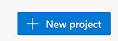
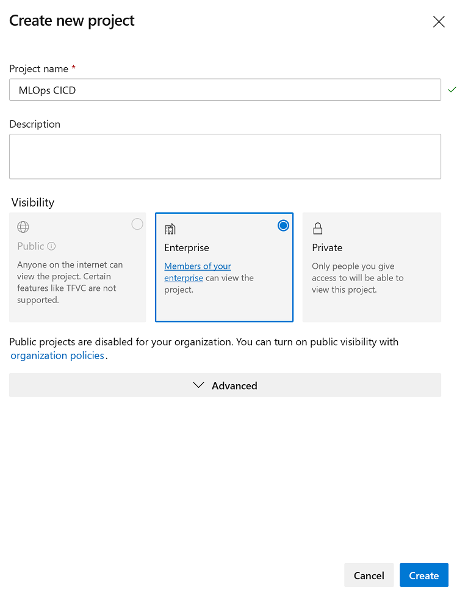

# Azure Customer Churn Hackathon


## 4 Model Deployment Automation with Azure DevOps (CI/CD)

### Contents

- __4 Model Deployment Automation with Azure DevOps (CI/CD)__
  * [4.1 Service Principal Authentication](#41-service-principal-authentication)
  * [4.2 Azure DevOps MLOPs Pipeline](#42-azure-devops-mlops-pipeline)
    + [4.2.1 Connecting Azure Databricks to Azure DevOps](#421-connecting-azure-databricks-to-azure-devops)
    + [4.2.2 Create a new Pipeline MLOps Pipeline](#422-create-a-new-pipeline-mlops-pipeline)
    + [4.2.3 Adding Databrick Pipeline Tasks from Marketplace](#423-adding-databrick-pipeline-tasks-from-marketplace)
    + [4.2.3.1 Generate a Personal Access Token in Databricks](#4231-generate-a-personal-access-token-in-databricks)


### 4.1 Service Principal Authentication

When setting up a machine learning workflow as an automated process, we recommend using Service Principal Authentication. This approach decouples the authentication from any specific user login, and allows managed access control.
Note that you must have administrator privileges over the Azure subscription to complete these steps.
The first step is to create a service principal. First, go to [Azure Portal](https://portal.azure.com/), select __Azure Active Directory__ and __App Registrations__. Then select __+New application__, give your service principal a name, for example my-svc-principal. You can leave other parameters as is.

Then click __Register__.


From the page for your newly created service principal, copy the _Application ID_ and _Tenant ID_ as they are needed later.


Then select __Certificates & secrets__, and __+New client secret__ write a description for your key, and select duration. Then click __Add__, and copy the value of client secret to a secure location.


Finally, you need to give the service principal permissions to access your workspace. Navigate to __Resource Groups__, to the resource group for your Machine Learning Workspace.

Then select __Access Control (IAM)__ and Add a __role assignment__. For Role, specify which level of access you need to grant, for example Contributor. Start entering your service principal name and once it is found, select it, and click __Save__.


Now you are ready to use the service principal authentication. For example, to connect to your Workspace, see code below and enter your own values for tenant ID, application ID, subscription ID, resource group and workspace.

It is strongly recommended that you do not insert the secret password to code. Please create a Key Vault back secret scope as you did in [2.2 Create a Secret and Secret scope for Azure Storage Account](02-DataLoad#22-create-a-secret-and-secret-scope-for-azure-storage-account).

Update you Azure Databricks Notebooks to use **Service Principal Authentication**.

```python
from azureml.core.authentication import ServicePrincipalAuthentication

svc_pr_password = dbutils.secrets.get(scope = "Secret Scope", key = "Secret")

svc_pr = ServicePrincipalAuthentication(
    tenant_id="Tenent ID",
    service_principal_id="Application ID",
    service_principal_password=svc_pr_password)


ws = Workspace(workspace_name = workspace_name,
               subscription_id = subscription_id,
               resource_group = resource_group,
               auth=svc_pr)
```

### 4.2 Azure DevOps MLOPs Pipeline

Go to your Azure DevOps organization '<https://[organization].visualstudio.com/>' and create a new project.






#### 4.2.1 Connecting Azure Databricks to Azure DevOps

  After creating your new project, your will need to initialize the Repository.


Then follow the steps for [Azure DevOps Services Version Control](https://docs.microsoft.com/en-us/azure/databricks/notebooks/azure-devops-services-version-control)

#### 4.2.2 Create a new Build Pipeline MLOps Pipeline


Start with an **Empty Job**

#### 4.2.3 Adding Databrick Pipeline Tasks from Marketplace

Go to **Add Task** then search for **Databricks**. You will need to add the Databricks tasks from the _Marketplace_.


**This does require elevated permissions on the subscription**

#### 4.2.3.1 Generate a Personal Access Token in Databricks

You will need to add a Databricks' Personal Access Token to the pipeline tasks.

Generate a Databricks [Personal Access Token](https://docs.microsoft.com/en-us/azure/databricks/dev-tools/api/latest/authentication#--generate-a-token)

Example of _Build pipeline_


#### 4.2.3.2 Passing Build Parameters using Azure Databricks Widgets

We can record the build number from Azure DevOps with our experiment to simplify tracking runs with data prep and model changes. To pass the build number as a parameter to Azure Databricks we will use a Notebook parameter through the use of [Azure Databricks Widgets](https://docs.microsoft.com/en-us/azure/databricks/notebooks/widgets)

In command cell 1 of our Training Notebook add the following to create our notebook parameters.

```python
dbutils.widgets.text("buildNumber","","buildNumber")
buildNumber = str(dbutils.widgets.get("buildNumber"))

dbutils.widgets.text("buildSource","","buildSource")
buildSource = str(dbutils.widgets.get("buildSource"))
```


#### 4.2.4 Create a new Release Pipeline MLOps Pipeline

pipeline_release.png

- **New Release** Pipeline and start with **Empty Job**
- Add a new _Stage_ calling it _"Stage"_ or _"QA"_.


Then click __Jobs Tasks__ to start building the release workflow.

job_tasks.PNG

We will be working with our Azure Databricks deployment Notebooks during the release pipeline:

release_tasks.PNG


#### 4.2.4.1 Passing Deployment Parameters using Azure Databricks Widgets


deploy_adb_widgets.PNG

https://docs.microsoft.com/en-us/azure/databricks/notebooks/widgets


__Example Release__


release_pipeline.PNG


