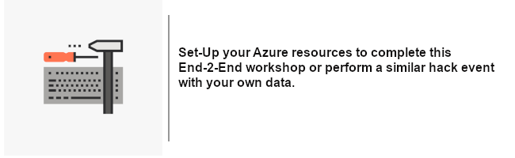
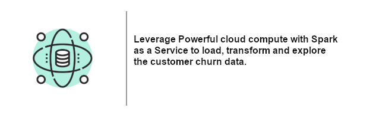
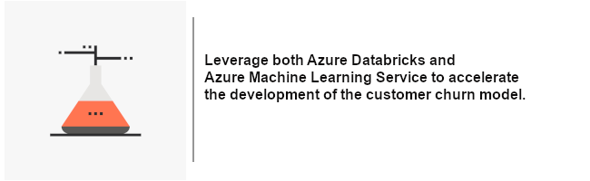
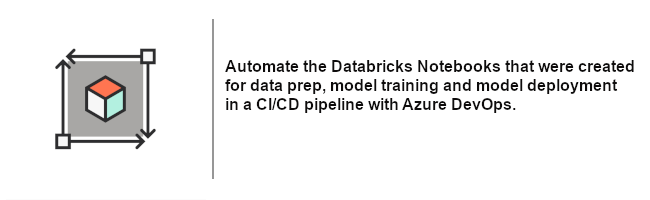

# Azure Customer Churn Workshop / Hack Event

Let’s get hands-on with __Azure Machine Learning__ by working through a customer churn prediction solution. During this event we will quickly gain experience with Azure Machine Learning and __Azure Databricks__. We can use the provided data to step though the documentation as a workshop or connect to your own data and _hack_ together an E2E solution for your specific needs.

## Objectives

- Learn how to __securely ingest data__ from __Azure Storage Account__ with _Azure Databricks__
- __Visualize and transform__ data using __Azure Databricks__ collaborative notebooks.
- __Track__ Machine Learning __Experiments__ with __Azure Machine Learning__
- Leverage __Azure Automated Machine Learning__ to accelerate identifying the _best_ model fro deployment
- __Register and deploy models__ with Azure Machine Learning
- Develop __CICD MLOPs__ with __Azure DevOps__, __Azure Databricks__ and __Azure Machine Leaning__

## [Step 1 - Hackathon Prerequisites](01-PreReq/)

The following resources are implemented through-out this material, please ensure you can create in your subscription or resource group:
- [Azure Storage Account - Blob](https://docs.microsoft.com/en-us/azure/storage/common/storage-account-overview)
- [Azure Machine Learning Workspace](https://docs.microsoft.com/en-us/azure/machine-learning/overview-what-is-azure-ml)
- [Azure Databricks](https://docs.microsoft.com/en-us/azure/azure-databricks/what-is-azure-databricks)
- [Azure DevOps](https://docs.microsoft.com/en-us/azure/devops/user-guide/what-is-azure-devops?view=azure-devops)

## [Step 2 - Data Load with Azure Databricks](02-DataLoad/)

## [Step 3 - Azure Automated ML and Azure Databricks](03-AutoML/)

## [Step 4 - Model Deployment Automation with Azure DevOps (CI/CD)](04-MLOps-CICD/)

